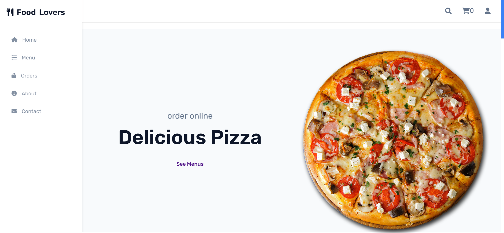
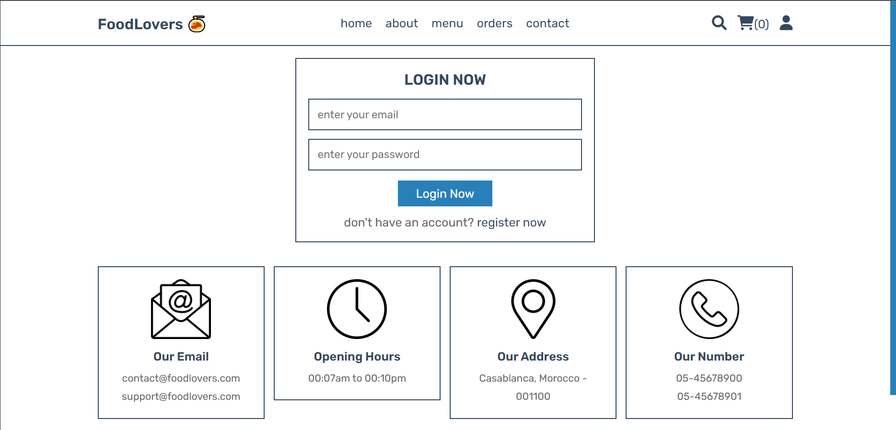
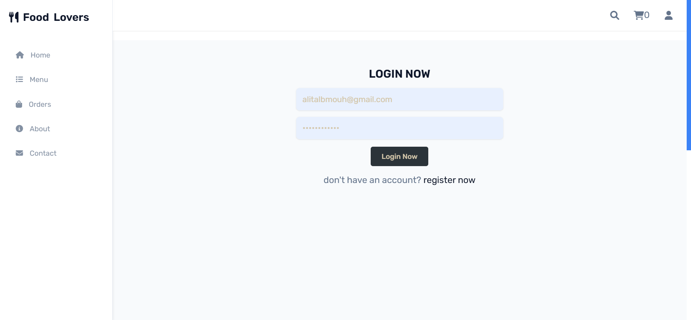
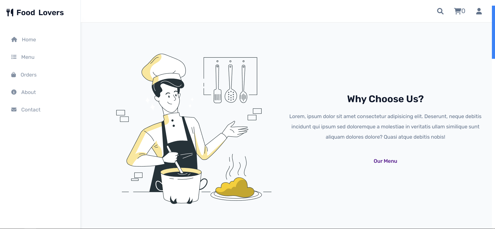
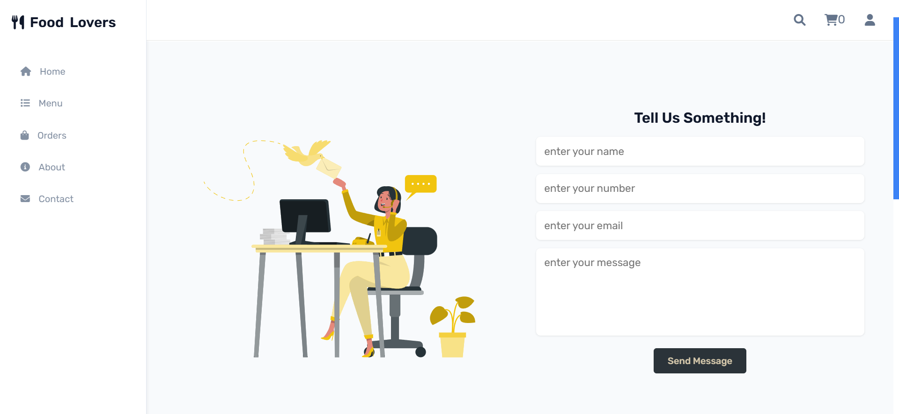

# 🍽️ Food Ordering System

The JIRA ( Project / Modelisation diagrams / Sprints ) FOR MEMBERS 🔒:
`https://ounessaghezzaf18.atlassian.net/jira/software/projects/SCRUM/boards/1/backlog?atlOrigin=eyJpIjoiZTFiN2ViOWI5OWU4NDM0ZDhiMjE0YmYxYjgzZTE0MmEiLCJwIjoiaiJ9`

A full-stack web application for restaurant food ordering and management, built with PHP and MySQL.

## 🌟 Features

### Customer Features

- User registration and authentication
- Browse food menu with categories
- Search functionality
- Shopping cart management
- Order placement and tracking
- Profile management
- Address management
- Order history

### Admin Features

- Secure admin dashboard
- Product management (Add/Edit/Delete)
- Order management
- User management
- Admin account management
- Sales tracking
- Message management

## 🛠️ Technologies Used

- **Frontend:** HTML5, CSS3, JavaScript
- **Backend:** PHP
- **Database:** MySQL
- **Additional:** PDO (PHP Data Objects) for database operations

## 📋 Prerequisites

- PHP >= 8.1
- MySQL >= 5.7
- Web server (XAMPP/Nginx)
- Web browser

## ⚙️ Installation

1. Clone the repository

- git clone https://github.com/AliTalebmoh/FoodApp

2. Import the database

- Create a new database named `food_db`
- Import the `food_db.sql` file from the project root

3. Configure database connection

- Open `components/connect.php`
- Update database credentials if needed

4. Start your web server

5. Access the application

- Customer panel: `http://localhost/FoodApp`
- Admin panel: `http://localhost/FoodApp/admin`

## 👤 Default Admin Credentials

Username: admin
Password: 111

## 📱 Screenshots

HOME PAGE:

MENU:

LOGIN:

ABOUT:

CONTACT: (`And Much More`)


## 🔒 Security Features

- Password hashing using SHA1
- Input sanitization
- Session management
- SQL injection prevention using PDO prepared statements
- Access control for admin panel

## 🗂️ Project Structure

```
food-ordering-system/
├── admin/                  # Admin panel files
├── components/            # Reusable PHP components
├── css/                  # Stylesheets
├── js/                   # JavaScript files
├── uploaded_img/         # Product images
├── *.php                 # Main PHP files
└── food_db.sql           # Database file
```

## 💡 Key Features Explained

### User Management

- Secure registration and login system
- Profile management with update capabilities
- Address management for delivery

### Product Management

- Category-based product organization
- Image upload functionality
- Price and stock management

### Order System

- Shopping cart functionality
- Multiple payment method options
- Order tracking system
- Order history

### Admin Dashboard

- Sales overview
- Order management
- User management
- Product management
- Message system

## 🤝 Contributing

Contributions are welcome! Please feel free to submit a Pull Request.

## 📄 License

This project is licensed under the MIT License - see the [LICENSE](LICENSE) file for details.

## 👨‍💻 Author

Ali Talebmoh | Youness Aghezzaf

## 🙏 Acknowledgments

- Font Awesome for icons
